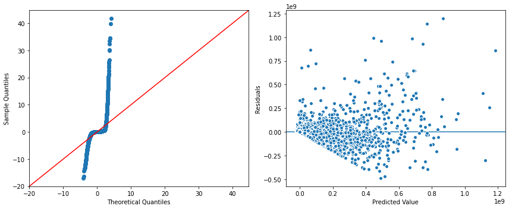
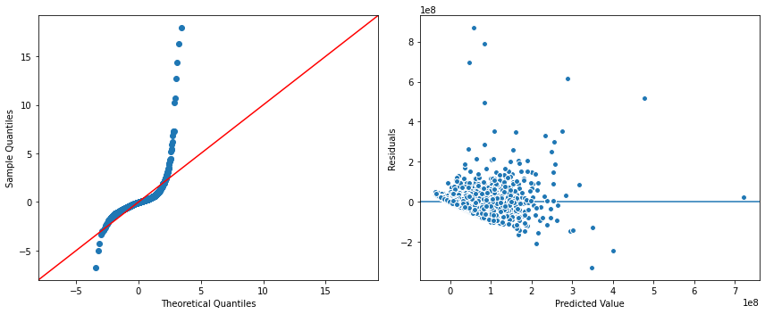

# Project-3- 
 
# IMDB Movie Suggestions for Success 

**Jonny Tesfahun**\

### Analysis of revenue and what makes a movie successful. 

Brief Description of Data:

The data is a collection of MySQL database on Movies from a subset of IMDB's publicly available dataset. It includes 3 databases Basics, Akas, and Ratings. The few columns in Basics include titleType, originalTitle, genres, runtimeMinutes, startYear, and endYear. The columns in Akas include region, language, and attributes. The columns in Rating are averageRating and numVotes. 

### Data Source:

###### title_basic = ("https://datasets.imdbws.com/title.basics.tsv.gz")
###### title_akas = ("https://datasets.imdbws.com/title.akas.tsv.gz")
###### title_ratings = ("https://datasets.imdbws.com/title.ratings.tsv.gz")

### Objective Goal:

The objective goal is to analyze what makes a movie successful and provide recommendations to the stakeholder on how to make a successful movie. 
- Hypothesis testing will be utilized to explore what makes a movie successful. 
- In addition, a Linear Regression model will be used to make 3 recommendations for the stakeholders on how to create a successful movie.

### Business problem:

*What is the actual revenue for the different ratings?*\
*Is there a significant difference between the MPAA rating of a movie and how much revenue the movie generates.?*\
*Is there a significant difference between movie's with 90 minutes or less runtime and how much revenue the movie generates?*\
*Is there a significant difference between movie's with and without "Love" tagline and how much revenue they generate?*\
*What makes a movie successful?*

### Methods
- Downloaded several files from IMDB’s movie data set and filtered out the subset of movies requested by the stakeholder.
- Cleaned the data for any Errors and or Inconsistencies
- Used an API to extract box office revenue and profit data to add to your IMDB dataset
- Constructed and exported a MySQL database using the new data.
- Used Histogram and Boxplot for Visual Exploratory Data Analysis
- Incorporated Informative Multivariate Presentation Visuals for Closer Analysis of Data
 - Applied Hypothesis testing to explore what makes a movie successful.
- Produced a Linear Regression model to predict movie performance.

### Results 

- The first hypothesis test revealed that we could reject the null hypothesis and support the alternative hypothesis. Our One-way Anova test showed that the pvalue was much less than our alpha level (0.05). 

#### Visual 1 - Final Conclusion: Cert. Rating vs. Revenue

> "Thus, there was evidence that there is a significant difference between the MPAA rating of a movie and how much revenue the movie generates."
> 

- The second hypothesis test was comparing revenue to movie runtime with less than 90min and more than 90min. The 2-sample t-test revealed that we could also reject the null hypothesis and support the alternative hypothesis. There is a visual representation below.
 #### Visual 2 - Comparison of Movie Revenue by Movie Runtime

> " There is evidence that there is a significant difference between movie's with 90 minutes or less runtime and how much revenue the movie generates."
> 

- The third hypothesis test if there is a difference in revenue for movies with and without "love" incorporated in the movie's tagline. The average revenue for movies with "love" in the tagline was $33,072,031.95. The average revenue for movies without "love" in the tagline is $63,978,189.25.

#### Visual 3 -  Movies with "Love" tagline vs Revenue

> "Evidence shows that movies with and without the "Love" tagline generate significantly different revenue." 
>

- Based on the Hypothesis Testing and Visual Exploratory Data Analysis fascinating results appeared. First being that the MPAA rating or certification has an impact on a movie's success. Second, movies with a runtime of 90 minutes and longer are more financially productive. Then finally movies without "love" in the description tagline seem to overall be more successful. 

### Manual Linear Regression Model Result 

The manual linear regression model was Statsmodels OLS and was tested for all 4 assumptions. This included Linearity, Independence of features, Normality,  and Homoscedasticity. Feature Engineering was used to exclude columns and append new columns. A QQ-Plot was utilized for checking for normality and Z_scores were used to remove outliers. A Pairplot was also utilized to check for linearity. 

#### Visual 4 - First Model Results

> "First model R-squared was 0.752." 
>

#### Visual 5 - Final Model Results

> "Final model R-squared was 0.527." 
>

- The Manual Linear Regression Model predictive results were fascinating. The results showed that the day a movie is released has the most impact on a movie's success. The model also showed that MPAA rating or certification for a movie to be successful should be NR (Not Rated), G (General Audiences), or NC-17 (No One 17 and Under). In addition, the movies with the most success financially were in the War or Comedy genres.   

> "Final model important key features to a successful movie." 
>

## Recommendations:

- Could have used a different Alternative Regressor. Instead of comparing results using a Random Forest Regressor, could have used another faster model. For instance, a Decision Tree. 

### For further information

For any additional questions, please contact **https://www.linkedin.com/in/jonny-m-tesfahun-a99496218/**
